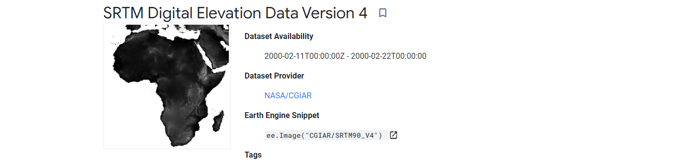

=====================================
Download DEM from SRTM90 dataset
=====================================
*Written by Men Vuthy, 2022*

----------

Objective
---------------

* Vizualize digital elevation model (DEM) of SRTM90 version 4 from Google Earth Engine.
* Download DEM within region of interest (Cambodia).

Dataset
---------------

The `Shuttle Radar Topography Mission (SRTM) <https://developers.google.com/earth-engine/datasets/catalog/CGIAR_SRTM90_V4#description>`__ digital elevation dataset was originally produced to provide consistent, high-quality elevation data at near global scope. This version of the SRTM digital elevation data has been processed to fill data voids, and to facilitate its ease of use.

Code
---------------

The SRTM DEM dataset can be visualized using the code snippet below:

.. code-block:: JavaScript

    // Import DEM dataset
    var dataset = ee.Image('CGIAR/SRTM90_V4');

    // Select bands
    var elevation = dataset.select('elevation');

    // Calculates slope in degrees from a terrain DEM.
    var slope = ee.Terrain.slope(elevation);

    // Set center to Cambodia and add slope layer to interactive map
    Map.setCenter(105.237, 12.164, 7);
    Map.addLayer(slope, {min: 0, max: 60}, 'slope');

.. figure:: img/STRM90_dataset.png
    :width: 1200px
    :align: center

// Import feature of region of interest (Cambodia)
// Load country features from Large Scale International Boundary (LSIB) dataset.
var countries = ee.FeatureCollection('USDOS/LSIB_SIMPLE/2017');
var roi = countries.filter(ee.Filter.eq('country_co', 'CB'));

// Add ROI layer to interactive map
Map.addLayer(roi, {color:'green'}, 'basin');

// Clip DEM image to the target ROI
var elevation = dataset.select('elevation').clip(roi);

Map.addLayer(elevation,  {min: 0, max: 50}, 'elevation');

// Export.image.toDrive({
//   image: elevation,
//   description: 'pursat_RB',
//   scale: 90,
//   region: rb_pursat
// });

