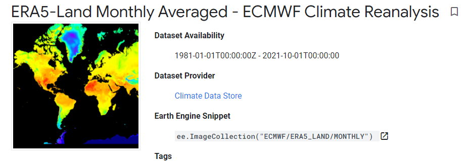
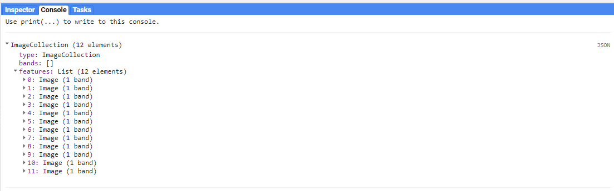
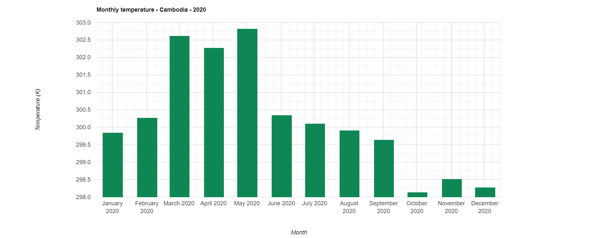

=======================================================================
Calculate monthly mean temperature from ECMWF Climate dataset
=======================================================================
*Written by Men Vuthy, 2022*

----------

Objective
---------------

* Vizualize temperature image of a given period in Cambodia.
* Calculate monthly mean temperature of Cambodia.

Dataset
---------------

`ERA5-Land <https://developers.google.com/earth-engine/datasets/catalog/ECMWF_ERA5_LAND_MONTHLY>`__ is a reanalysis dataset providing a consistent view of the evolution of land variables over several decades at an enhanced resolution compared to ERA5. ERA5-Land has been produced by replaying the land component of the ECMWF ERA5 climate reanalysis. Reanalysis combines model data with observations from across the world into a globally complete and consistent dataset using the laws of physics. Reanalysis produces data that goes several decades back in time, providing an accurate description of the climate of the past. This dataset includes all 50 variables as available on CDS.

The data presented here is a subset of the full ERA5-Land dataset post-processed by ECMWF. Monthly-mean averages have been pre-calculated to facilitate many applications requiring easy and fast access to the data, when sub-monthly fields are not required.

ERA5-Land data is available from 1981 to three months from real-time. More information can be found at the `Copernicus Climate Data Store <https://cds.climate.copernicus.eu>`__.

Code
---------------

**1. Visualize dataset**

ECMWF Climate Reanalysis dataset can be visualized using the code snippet below:

.. code-block:: JavaScript
    
    // Import dataset
    var dataset = ee.ImageCollection('ECMWF/ERA5_LAND/MONTHLY');

    // Select temperature band
    var temperature = dataset.select('temperature_2m');

    // Set palette for data range visualization
    var temperatureVis = {
        min: 250.0,
        max: 320.0,
        palette: [
            "#000080","#0000D9","#4000FF","#8000FF","#0080FF","#00FFFF",
            "#00FF80","#80FF00","#DAFF00","#FFFF00","#FFF500","#FFDA00",
            "#FFB000","#FFA400","#FF4F00","#FF2500","#FF0A00","#FF00FF",
        ]
    };

.. figure:: img/world-temp-image.png
    :width: 1200px
    :align: center

**2. Visualize temperature in Cambodia**

The feature boundary of Cambodia is based on the international boundary dataset provided by The United States Office of the Geographer. The boundary data is available in GEE and known as `LSIB 2017: Large Scale International Boundary Polygons <https://developers.google.com/earth-engine/datasets/catalog/USDOS_LSIB_SIMPLE_2017#description>`__. The country name code can be referred to `FIPS country codes <https://en.wikipedia.org/wiki/List_of_FIPS_country_codes>`__. With this feature, we can clip the temperature global image to the shape of our region of interest.

.. code-block:: JavaScript

    // Load country features from Large Scale International Boundary (LSIB) dataset.
    var countries = ee.FeatureCollection('USDOS/LSIB_SIMPLE/2017');

    // Filter boundary to Cambodia with the code name 'CB'
    var roi = countries.filter(ee.Filter.eq('country_co', 'CB'));

    // Filter images to Jan 2020 and clip it
    var temp = temperature.filter(ee.Filter.calendarRange(2020, 2020, 'year'))
                    .filter(ee.Filter.calendarRange(1, 1, 'month'))
                    .sum()
                    .clip(roi);

    // Set palette for data range visualization
    var temperatureVis_cambo = {
        min: 290.0,
        max: 330.0,
        palette: [
            "#000080","#0000D9","#4000FF","#8000FF","#0080FF","#00FFFF",
            "#00FF80","#80FF00","#DAFF00","#FFFF00","#FFF500","#FFDA00",
            "#FFB000","#FFA400","#FF4F00","#FF2500","#FF0A00","#FF00FF",
        ]
    };

    // Add layer to map
    Map.addLayer(temp, temperatureVis_cambo, 'Temperature');

.. figure:: img/cambodia-temp.png
    :width: 1200px
    :align: center

**3. Extract all temperature images within given year**

To calculate mean temperature of each month, we must set a target year and then extract all the images from image collection that correspond to the given year. 

.. code-block:: JavaScript

    // set start year and end year
    var startyear = 2019;
    var endyear = 2021
 
    // make a list with years
    var years = ee.List.sequence(startyear, endyear);

    // make a list with months
    var months = ee.List.sequence(1, 12);

    // Extract all images within given year
    var monthlyTemp =  ee.ImageCollection.fromImages(
    years.map(function (y) {
        return months.map(function(m) {
        var temp = temperature.filter(ee.Filter.calendarRange(y, y, 'year'))
                        .filter(ee.Filter.calendarRange(m, m, 'month'))
                        .sum()
                        .clip(roi);
        return temp.set('year', y)
                .set('month', m)
                .set('system:time_start', ee.Date.fromYMD(y, m, 1));
        });
    }).flatten()
    );

    print(monthlyTemp)

**4. Calculate monthly mean temperature of Cambodia**

After extracting images of given year, we can see that there are in total of 36 images which respond to 36 months or 3 years. In each image, there are a wide range of temperature in Kelvin. Therefore, we need to calculate the mean temperature of each image to get 36 mean temperature value. To do so, we can use a function call ``ee.Reducer.mean()`` as follows:

.. code-block:: JavaScript

    var chartMonthly = ui.Chart.image.seriesByRegion({
        imageCollection: monthlyTemp,
        regions: roi,
        reducer: ee.Reducer.mean(),
        scale: 2500,
        xProperty: 'system:time_start',
        seriesProperty: 'temperature',
    })
    .setChartType('ColumnChart')
    .setOptions({ title: 'Monthly temperature - Cambodia - 2020',
                  hAxis: {title: 'Month', titleTextStyle: {italic: true, bold: false}},
                  vAxis: {title: 'Temperature (K)', titleTextStyle: {italic: true, bold: false}},
                  colors: ['0f8755']
                });
 
    print(chartMonthly);

Finally, we can see how to calculate and download monthly mean temperature from  ECMWF Climate dataset in Google Earth Engine.

----------

**Reference**

* ECMWF ERA5 climate reanalysis: https://developers.google.com/earth-engine/datasets/catalog/ECMWF_ERA5_LAND_MONTHLY
* LSIB 2017: https://developers.google.com/earth-engine/datasets/catalog/USDOS_LSIB_SIMPLE_2017#description
* ui.Chart.image.seriesByRegion: https://developers.google.com/earth-engine/apidocs/ui-chart-image-seriesbyregion
* ee.Reducer.mean : https://developers.google.com/earth-engine/apidocs/ee-reducer-mean
