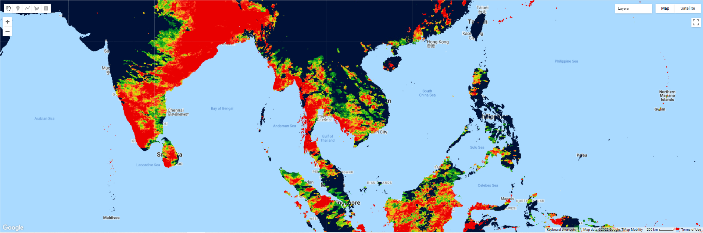

=======================================================================
Calculate monthly mean rainfall from CHIRPS Daily dataset
=======================================================================
*Written by Men Vuthy, 2022*

----------

Objective
---------------

* Vizualize rainfall image of a given date in Cambodia.
* Calculate monthly mean rainfall of Cambodia.

Dataset
---------------

Climate Hazards Group InfraRed Precipitation with Station data (`CHIRPS <https://developers.google.com/earth-engine/datasets/catalog/UCSB-CHG_CHIRPS_DAILY>`__) is a 30+ year quasi-global rainfall dataset. CHIRPS incorporates 0.05° resolution satellite imagery with in-situ station data to create gridded rainfall time series for trend analysis and seasonal drought monitoring.

.. figure:: img/CHIRPS.png
    :width: 700px
    :align: center
    :alt: ERA5 Climate Reanalysis

Code
---------------

**1. Visualize dataset**

CHIRPS Daily dataset can be visualized using the code snippet below:

.. code-block:: JavaScript
    
    // Import CHIRPS dataset and filter to 01-Sep-2020
    var dataset = ee.ImageCollection('UCSB-CHG/CHIRPS/DAILY')
                    .filter(ee.Filter.date('2020-09-01', '2020-09-02'));
                  
    // Select bands
    var precipitation = dataset.select('precipitation');

    // Create visualization palette
    var precipitationVis = {
        min: 1.0,
        max: 17.0,
        palette: ['001137', '0aab1e', 'e7eb05', 'ff4a2d', 'e90000'],
    };

    // Set center for zooming
    Map.setCenter(104.405, 13.158, 6);

    // Add layer to map
    Map.addLayer(precipitation, precipitationVis, 'Precipitation');

**2. Visualize rainfall in Cambodia**

The feature boundary of Cambodia is based on the international boundary dataset provided by The United States Office of the Geographer. The boundary data is available in GEE and known as `LSIB 2017: Large Scale International Boundary Polygons <https://developers.google.com/earth-engine/datasets/catalog/USDOS_LSIB_SIMPLE_2017#description>`__. The country name code can be referred to `FIPS country codes <https://en.wikipedia.org/wiki/List_of_FIPS_country_codes>`__. With this feature, we can clip the temperature global image to the shape of our region of interest.

.. code-block:: JavaScript

    // Load country features from Large Scale International Boundary (LSIB) dataset.
    var countries = ee.FeatureCollection('USDOS/LSIB_SIMPLE/2017');

    // Filter boundary to Cambodia with the code name 'CB'
    var roi = countries.filter(ee.Filter.eq('country_co', 'CB'));

    // Filter images to Jan 2020 and clip it
    var temp = temperature.filter(ee.Filter.calendarRange(2020, 2020, 'year'))
                    .filter(ee.Filter.calendarRange(1, 1, 'month'))
                    .sum()
                    .clip(roi);

    // Set palette for data range visualization
    var temperatureVis_cambo = {
        min: 290.0,
        max: 330.0,
        palette: [
            "#000080","#0000D9","#4000FF","#8000FF","#0080FF","#00FFFF",
            "#00FF80","#80FF00","#DAFF00","#FFFF00","#FFF500","#FFDA00",
            "#FFB000","#FFA400","#FF4F00","#FF2500","#FF0A00","#FF00FF",
        ]
    };

    // Add layer to map
    Map.addLayer(temp, temperatureVis_cambo, 'Temperature');

.. figure:: img/cambodia-temp.png
    :width: 1200px
    :align: center

**3. Extract all temperature images within given year**

To calculate mean temperature of each month, we must set a target year and then extract all the images from image collection that correspond to the given year. 

.. code-block:: JavaScript

    // set start year and end year
    var startyear = 2019;
    var endyear = 2021
 
    // make a list with years
    var years = ee.List.sequence(startyear, endyear);

    // make a list with months
    var months = ee.List.sequence(1, 12);

    // Extract all images within given year
    var monthlyTemp =  ee.ImageCollection.fromImages(
    years.map(function (y) {
        return months.map(function(m) {
        var temp = temperature.filter(ee.Filter.calendarRange(y, y, 'year'))
                        .filter(ee.Filter.calendarRange(m, m, 'month'))
                        .sum()
                        .clip(roi);
        return temp.set('year', y)
                .set('month', m)
                .set('system:time_start', ee.Date.fromYMD(y, m, 1));
        });
    }).flatten()
    );

    print(monthlyTemp)

.. figure:: img/list_img_temp.png
    :width: 1200px
    :align: center

**4. Calculate monthly mean temperature of Cambodia**

After extracting images of given year, we can see that there are in total of 36 images which respond to 36 months or 3 years. In each image, there are a wide range of temperature in Kelvin. Therefore, we need to calculate the mean temperature of each image to get 36 mean temperature value. To do so, we can use a function call ``ee.Reducer.mean()`` as follows:

.. code-block:: JavaScript

    var chartMonthly = ui.Chart.image.seriesByRegion({
        imageCollection: monthlyTemp,
        regions: roi,
        reducer: ee.Reducer.mean(),
        scale: 2500,
        xProperty: 'system:time_start',
        seriesProperty: 'temperature',
    })
    .setChartType('ColumnChart')
    .setOptions({ title: 'Monthly temperature - Cambodia - 2020',
                  hAxis: {title: 'Month', titleTextStyle: {italic: true, bold: false}},
                  vAxis: {title: 'Temperature (K)', titleTextStyle: {italic: true, bold: false}},
                  colors: ['0f8755']
                });
 
    print(chartMonthly);

.. figure:: img/monthly-temp-chart.png
    :width: 1200px
    :align: center

Finally, we can see how to calculate and download monthly mean temperature from  ECMWF Climate dataset in Google Earth Engine.

----------

**Reference**

* ECMWF ERA5 climate reanalysis: https://developers.google.com/earth-engine/datasets/catalog/ECMWF_ERA5_LAND_MONTHLY
* LSIB 2017: https://developers.google.com/earth-engine/datasets/catalog/USDOS_LSIB_SIMPLE_2017#description
* ui.Chart.image.seriesByRegion: https://developers.google.com/earth-engine/apidocs/ui-chart-image-seriesbyregion
* ee.Reducer.mean : https://developers.google.com/earth-engine/apidocs/ee-reducer-mean
