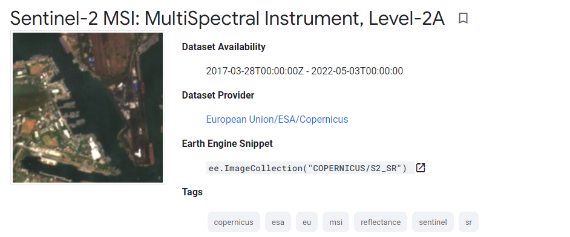
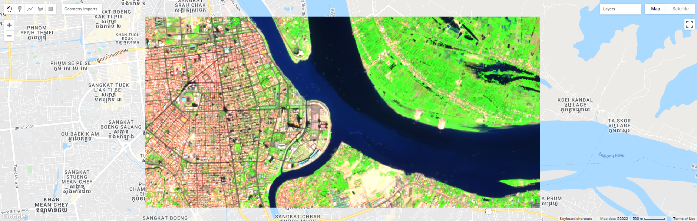
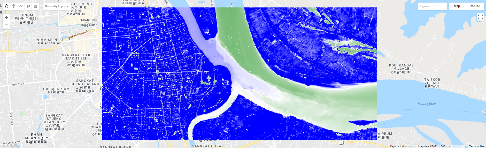

=======================================================================
Calculate water turbidity index (WTI) from Sentinel-2
=======================================================================
*Written by Men Vuthy, 2022*

----------

Objective
---------------

* Vizualize SWIR composite image of Chaktomuk river in 2021 in Phnom Penh.
* Calculate water turbidity index.
* Export WTI image.

Dataset
---------------

`Sentinel-2 <https://developers.google.com/earth-engine/datasets/catalog/COPERNICUS_S2_SR#description>`__ is a wide-swath, high-resolution, multi-spectral imaging mission supporting Copernicus Land Monitoring studies, including the monitoring of vegetation, soil and water cover, as well as observation of inland waterways and coastal areas. The assets contain 12 UINT16 spectral bands representing SR scaled by 10000 (unlike in L1 data, there is no B10).

Code
---------------

**1. Visualize dataset**

Sentinel-2 image can be visualized using the code snippet below:

.. code-block:: JavaScript
    
    // Set the area of interest 
    var roi = ee.Geometry.Polygon([[[104.90218375201758, 11.577174953667186],
                            [104.90218375201758, 11.533783997142853],
                            [104.99350760455664, 11.533783997142853],
                            [104.99350760455664, 11.577174953667186]]], null, false);
                  
    // Create function to mask cloud in Sentinel-2 images
    function maskS2clouds(image) {
    var qa = image.select('QA60');

    // Bits 10 and 11 are clouds and cirrus, respectively.
    var cloudBitMask = 1 << 10;
    var cirrusBitMask = 1 << 11;

    // Both flags should be set to zero, indicating clear conditions.
    var mask = qa.bitwiseAnd(cloudBitMask).eq(0)
        .and(qa.bitwiseAnd(cirrusBitMask).eq(0));

    return image.updateMask(mask).divide(10000);
    }

    // Load Sentinel-2 images
    var dataset = ee.ImageCollection('COPERNICUS/S2_SR')
                    .filterDate('2020-01-01', '2020-01-30')
                    // Pre-filter to get less cloudy granules.
                    .filter(ee.Filter.lt('CLOUDY_PIXEL_PERCENTAGE',10))
                    .map(maskS2clouds);

    // Clip images to area boundary
    var roi_image = dataset.mean().clip(roi)

    // Set visualization
    var visualization = {
    min: 0.0,
    max: 0.3,
    bands: ['B12', 'B8', 'B4'],
    };

    // Set center for zooming
    Map.centerObject(roi, 14)

    // Add layer to map
    Map.addLayer(roi_image, visualization, 'SWIR_image');

**2. Calculate water turbidity index.**

Water turbidity index (WTI) based on multispectral images was developed and tested at Kushiro Mire, eastern Hokkaido, Japan [1]. The WTI was adopted by Gaëtan Lefebvre et al. 2019 [2] and the formula was derived as follows:

.. math::

   WTI = 0.91 * Red + 0.43 * NIR

Here, I applied this formula in GEE to calculate water turbidity index using Sentinel-2 images. 

.. code-block:: JavaScript

    // Create fuction to calculate water turbidity index
    var addWTI = function wti(image){
    var wt = image.expression('0.91 * RED + 0.43 * NIR', {
        'RED': image.select('B4'),
        'NIR':image.select('B8')}).rename('WTI');
    
    return image.addBands(wt);
    };

    // Calculate water turbidity index
    var turbidity = addWTI(roi_image).select('WTI');

    // Set visualization
    var visualization_wti = {
    min: 0.0,
    max: 0.2,
    palette: ['green','white', 'blue'],
    };

    // Add layer to map
    Map.addLayer(turbidity, visualization_wti, 'Turbidity');

**3. Export WTI image**

By running below snippet, the Tasks tab will appear a Run button. After clicking that button, the turbidity image of Chaktomuk river will be stored in your google drive.

.. code-block:: JavaScript

    // Export image to google drive
    Export.image.toDrive({
    image: turbidity,
    description: 'Turbidity',
    fileFormat: 'GeoTIFF',
    scale: 10,
    region: roi
    });

----------

**Reference**

* [1] Kameyama, S., Yamagata, Y., Nakamura, F., & Kaneko, M. (2001). Development of WTI and turbidity estimation model using SMA—application to Kushiro Mire, eastern Hokkaido, Japan. Remote Sensing of Environment, 77(1), 1-9.
* [2] Lefebvre, G., Davranche, A., Willm, L., Campagna, J., Redmond, L., Merle, C., ... & Poulin, B. (2019). Introducing WIW for detecting the presence of water in wetlands with landsat and sentinel satellites. Remote sensing, 11(19), 2210.
