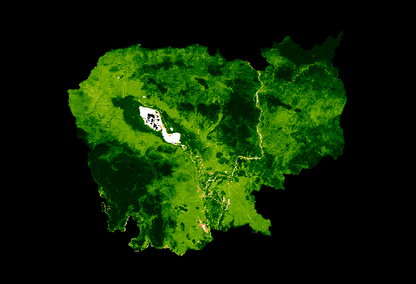

MODIS NDVI
=================================

---------

**Description**

The MOD13Q1 V6 product provides a Vegetation Index (VI) value at a per pixel basis. There are two primary vegetation layers. The first is the Normalized Difference Vegetation Index (NDVI) which is referred to as the continuity index to the existing National Oceanic and Atmospheric Administration-Advanced Very High Resolution Radiometer (NOAA-AVHRR) derived NDVI. The second vegetation layer is the Enhanced Vegetation Index (EVI) that minimizes canopy background variations and maintains sensitivity over dense vegetation conditions. The EVI also uses the blue band to remove residual atmosphere contamination caused by smoke and sub-pixel thin cloud clouds. The MODIS NDVI and EVI products are computed from atmospherically corrected bi-directional surface reflectances that have been masked for water, clouds, heavy aerosols, and cloud shadows.

**Dataset provider**

``NASA LP DAAC at the USGS EROS Center``

**Earth Engine Snippet**

``MODIS/006/MOD13Q1``

**Resolution**

250 meters

**Year of product**

2021 

