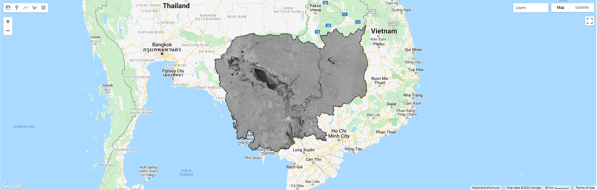

=======================================================================
Sentinel-1 SAR: Cambodia Flood in October 2020
=======================================================================
*Written by Men Vuthy, 2020*

---------------

.. note::
    This is a quick way to detect and extract the inundation area for analysis based on the Sentinel-1 SAR GRD images by using Google Earth Engine and QGIS.

.. image:: images/flood-cambo/Homepage.png
    :width: 100%
    :align: center
|
Heavy rain lashed Cambodia for over two weeks in October 2020, flooding 18 provinces and Phnom Pench city. According to figures reported by National Committee for Disaster Management (NCDM) in Cambodia from 1st to 19th October, 25 people were reported dead in the floods, about 300,000 people or 78,000 families were affected, and about 37,000 people or 9,000 families were displaced to safer zones. In addition, flood has also destroyed 56 houses and affected over 73,000 houses, while 568 schools were inundated. In this flood event, at least 80,000 ha crops and 210,000 ha paddy fields were inundated, whereas theirs damages has not been so far reported. On the other hand, many national and provincial roads were severely impacted by the effects of this prolonged flood.

.. image:: images/flood-cambo/report-1.png
    :width: 32%
.. image:: images/flood-cambo/report-2.png
    :width: 32%
.. image:: images/flood-cambo/report-3.png
    :width: 32%
Figure 1: Report and data summary on flood impact in 2020 in Cambodia.

Even though various data were collected and described in Figure 1 by NCDM, the area of flooding which shows the extend and location of flooding has remained unofficially published by any related institutions. Therefore, I would like to reveal a quick method to detect and extract the inundated area based on Sentinel-1 SAR GRD images by using Google Earth Engine in QGIS application. 

-----

---------------
Objective
---------------

1. Visualize the Sentinel-1 SAR GRD images of Cambodia from 15th to 20th October 2020 which is the most servere flooding period in the region. 
2. Detect inundation area in the images by setting a specific threshold value for waterbody.
3. Extract and export the image of inundation area as a GeoTIFF or Raster format from the cloud storage of Google Earth Engine.

-----

---------------
Methodology
---------------

Visualizing the Sentinel-1 SAR images, dectecting waterbody, and extracting it for other analysis can be performed in Google Earth Engine and QGIS by using EE Python API. Therefore, it is important to equip with some background on programming language and QGIS application. Below, I will instruct a few steps on how to visualize the images, detect waterbody and extract inundation area for other computation and analysis.

**1. Visualizing the Sentinel-1 SAR GRD images**

The code editor of Google Earth Engine is used for running the script below. Filter the collection of Sentinel-1 SAR GRU images for the VV and VH product from the descending track. Filter the date of interest, and add image layer into the map by clipping only Cambodia boundary. Here I used only VV products to analyze the waterbody. VH product can also be used; however, threshold value for determining the waterbody may be slightly different from VH product.

.. code-block:: JavaScript

    // Load country features from Large Scale International Boundary (LSIB) dataset.
    var countries = ee.FeatureCollection('USDOS/LSIB_SIMPLE/2017');
    var roi = countries.filter(ee.Filter.eq('country_co', 'CB'));
    Map.addLayer(roi,{},'Cambodia')

    //Let's centre the map view over our ROI
    Map.centerObject(roi, 6);

    // Filter the collection for the VV product from the descending track
    var collectionVV = ee.ImageCollection('COPERNICUS/S1_GRD')
        .filter(ee.Filter.eq('instrumentMode', 'IW'))
        .filter(ee.Filter.listContains('transmitterReceiverPolarisation', 'VV'))
        .filter(ee.Filter.eq('orbitProperties_pass', 'DESCENDING'))
        .filterBounds(roi)
        .select(['VV']);

    // Filter the collection for the VH product from the descending track
    var collectionVH = ee.ImageCollection('COPERNICUS/S1_GRD')
        .filter(ee.Filter.eq('instrumentMode', 'IW'))
        .filter(ee.Filter.listContains('transmitterReceiverPolarisation', 'VH'))
        .filter(ee.Filter.eq('orbitProperties_pass', 'DESCENDING'))
        .filterBounds(roi)
        .select(['VH']);

    // Adding the VV layer to the map at a specific date
    var image = ee.Image(collectionVV.filterDate('2020-10-14', '2020-10-20').median());
    Map.addLayer(image.clip(roi), {min: -25, max: 5}, 'Image_VV');

|
**2. Detecting inundation area**

The threshold value to differentiate the waterbody from the image is determined from the value of frequency value of VV. The value in the first peak area are generally considered as water value, while other high frequency value represents other types of classification including building, road, bared soil, crops, and forest. In order to compute, the scale should be set based on the size of the region of interest. The smaller the ROI is, the smaller the scale is. In the Cambodia scale, 500 resolution is set due to the fact that the higher resolution might not work due to the limition in GEE cloud when it comes to exporting.

.. code-block:: JavaScript

    // Compute the histogram of the Image
    var histogram = image.reduceRegion({
    reducer: ee.Reducer.histogram(255, 2)
        .combine('mean', null, true)
        .combine('variance', null, true), 
    geometry: roi, 
    scale: 500,
    bestEffort: true
    });

    // Chart the histogram
    print(Chart.image.histogram(image, roi, 500));

.. image:: images/flood-cambo/Threshold.png
  :width: 100%
  :alt: center

Figure 2: Histogram of VV showing the value for different type of landuse.

**3. Extract and export the image of inundation area**

The image pixels are classified as waterbody where theirs VV values are less than the threshold defined in Step 2, and the classified area can be extracted by masking the non-water area and clipped for Cambodia boundary. The classified image can be then exported as GeoTIFF by setting high maxPixels following the size of the region of interest. By running the code below in GEE, the result of inundation area as GeoTIFF file will be stored in the Google drive.

.. note::
    The smaller scale, the higher maxPixels.

.. code-block:: JavaScript

    // Chart the histogram
    print(Chart.image.histogram(image, roi, 500));

    // Classify the Image
    var flood = image.lt(-15);
    Map.addLayer(flood.mask(flood).clip(roi), {palette: 'blue'}, 'Flood');

    // Export image to raster file
    Export.image.toDrive({
    image: flood.mask(flood).clip(roi),
    description: 'FloodMap_2',
    scale: 10,
    region: roi,
    maxPixels:4000000000000
    });

.. note::
    In order to achieve similar result in QGIS, the script described above shall be converted into EE Python API.

-----

---------------
Result
---------------

This map will serves practitioners, policy makers or engineers as an important information for developing strategy to effectively mitigate flood impact under uncertain climate in the future.

-----
## Overview of Inundation Area in Cambodia

.. image:: images/flood-cambo/Inundation-Area_VV.png
    :width: 100%
    :align: left
|
Figure 3: (a) Sentinel-1 SAR Image of Cambodia from 15-20 October 2020.

.. image:: images/flood-cambo/Inundation-Area_VV_Flood.png
  :width: 45%
  :alt: alternate text
  :align: left
.. image:: images/flood-cambo/Inundation-Area.png
  :width: 45%
  :alt: alternate text
Figure 3: (b) Detected flooding area. (c) Extracted flooding area.