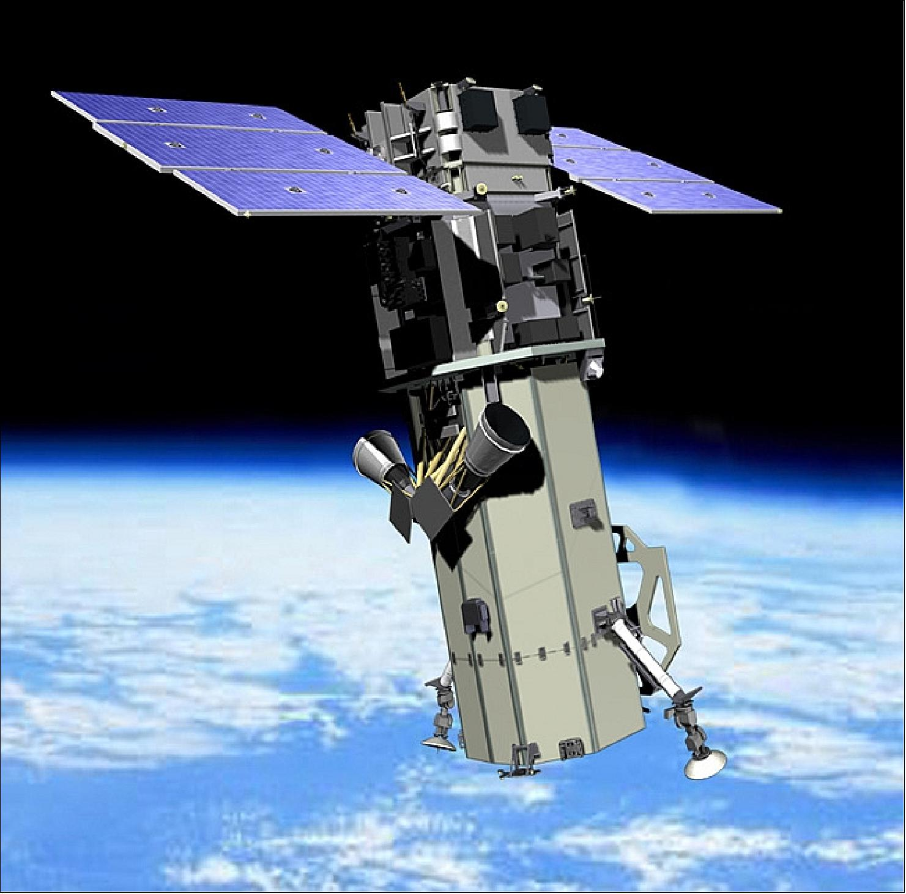
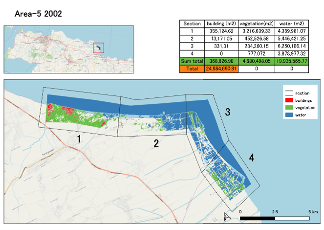
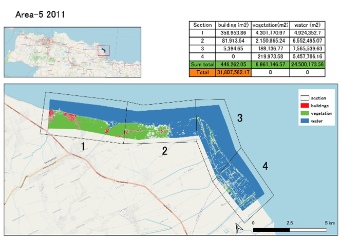
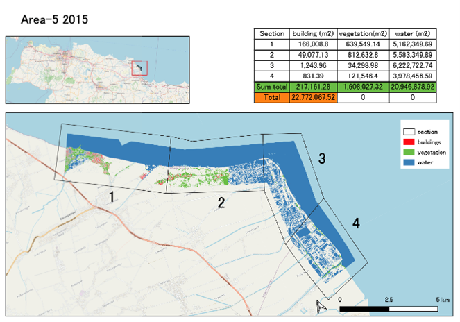
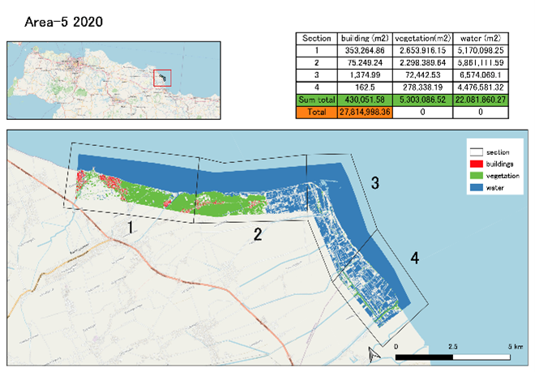
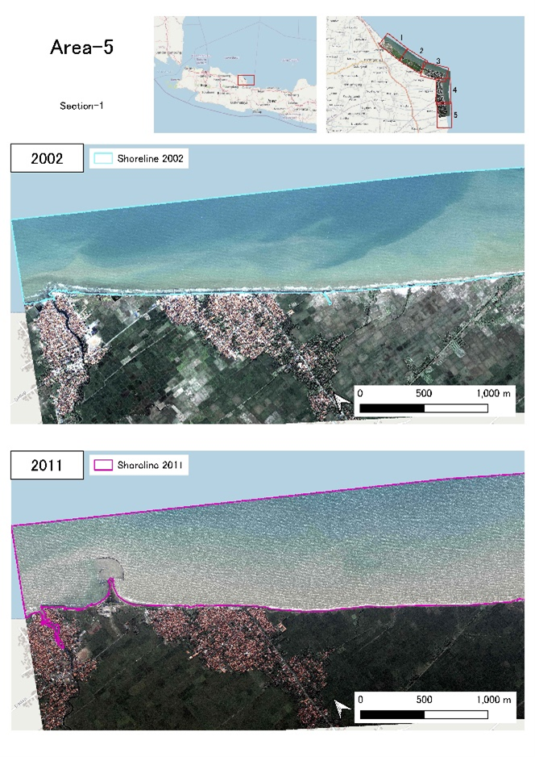
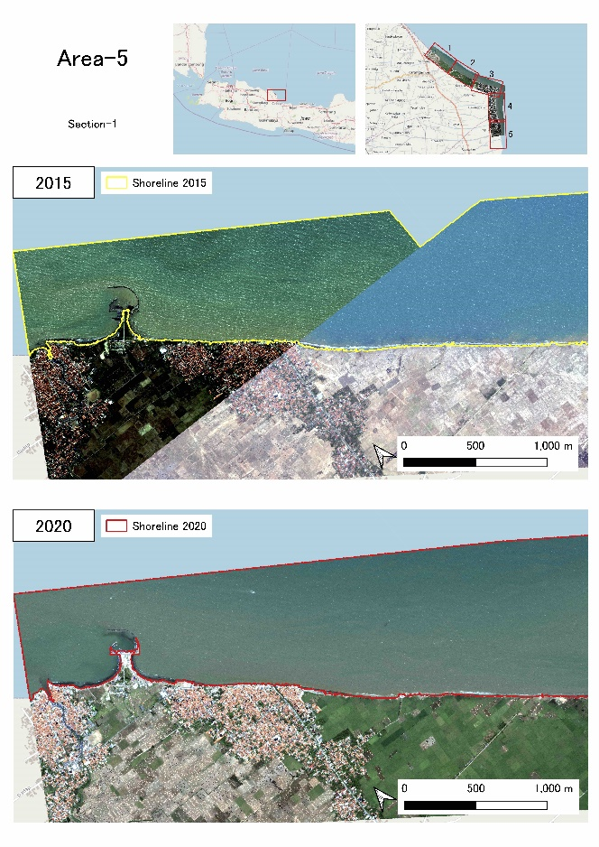

Indonesia project: high-resolution satellite image analysis
==============================================================================================

Background
--------------------
In this project, I conducted several analytic work and map development using high-resolution satellite image data of Northern Indonesia. It is the international project of the company I am working for; therefore, there are so many information I cannot disclose. However, what I present here is just the method I developed by myself, so it can be used for learning. By the way, the analysis includes area and shoreline extraction works for time-change comparison. The satellite images used for this analysis is World View series (WV) owned by Maxar Technologies (formerly DigitalGlobe) of the United States. In addition to high-frequency and high-precision photography, this satellite image has a high spatial resolution of about 30 cm.

Figure 1: WorldView-3 - Satellite Missions, `Source <https://directory.eoportal.org/web/eoportal/satellite-missions/v-w-x-y-z/worldview-3>`__  

.. csv-table:: 
   :file: indonesia-project/satellite-overview.csv
   :widths: 20, 30
   :header-rows: 1

WV images are multispectral, and for this study, the images consist of four different bands which are categorized based on specific wavelength range (i.e. Red [630 – 690 nm], Green [510 – 580 nm], Blue [450 – 510 nm], Near-IR [770 – 745 nm]). The standard indexes are calculated using these band values. 
	
Analysis methodology
-----------------------------

	**1. Water area extraction**
Water area is extracted based on NDWI (Normalized Difference Water Index) which ranges from -1 to 1. The formula of NDWI is as following:

.. math::
   :name: ndwi

   NDWI = \frac{(Green-NIR)}{(Green+NIR)}

Green: green band, NIR: near infrared band. NDWI value indicates clear characteristic of water in the image. The closer to 1 the value is, the more the characteristics of water area will be shown. By setting specific threshold value within the NDWI range, the water area can be extracted from the image, and the total surface area can also be calculated.

	**2. Vegetation area extraction**
Vegetation area is extracted based on NDVI (Normalized Difference Vegetation Index) which ranges from -1 to 1. The formula of NDVI is as following:

.. math::
   :name: ndvi

   NDVI = \frac{(NIR-Red)}{(NIR+Red)}

Red: red band, NIR: near infrared band. NDVI value indicates clear characteristic of vegetation in the image. The closer to 1 the value is, the more the characteristics of vegetation area will be shown. By setting specific threshold value within the NDVI range, the vegetation area can be extracted from the image, and the total surface area can also be calculated.

	**3. Building area extraction**
Building area is extracted based on BSI (Bare Soil Index) which ranges from -1 to 1. The formula of BSI is as following:

.. math::
   :name: bsi

   BSI = \frac{((Red+Blue)-Green)}{((Red+Blue)+Green)}

Red: red band, Blue: blue band, Green: green band. BSI value indicates clear characteristic of building in the image. The closer to 1 the value is, the more the characteristics of vegetation area will be shown. By setting specific threshold value within the BSI range, the building area can be extracted from the image, and the total surface area can also be calculated. However, the appearance of buildings differs depending on the image shooting conditions (sunshine conditions, clouds coverage, etc.) at the time of image acquisition. Moreover, when extracting the buildings, some unwanted areas within the range of extraction are also extracted along. In this case, manual removal is necessary to get a clean extraction. Therefore, exact extraction is somehow difficult to obtain.

In each area, water areas (including coastline extraction), vegetation areas, and urban areas were extracted, and the trends of change from year to year were organized. An example of the analysis result for Area-5 is shown below.

|
Figure 2: Sample of area extraction result and comparison

**4. Shoreline extraction**

Shoreline is drawn based on water area analyzed in above section. From the water area extraction, the shoreline appears clearer, and it then can be extracted directly from water area shape. However, the shoreline might not be perfect at some areas or in some parts of the extracted line; thus, manual correction and adjustment in QGIS application is required. An example of the analysis result for Area-5 is shown below. 

Figure 3: Sample of shoreline extraction result and comparison

.. toctree::
   :maxdepth: 2
   :caption: 

   indonesia-project/