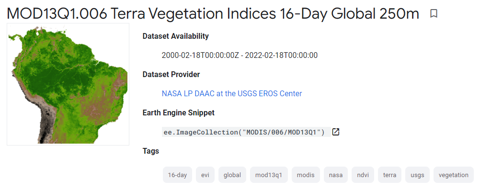
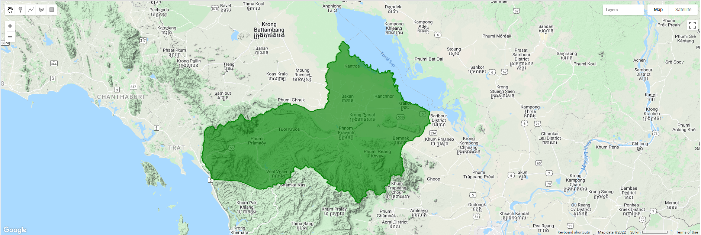
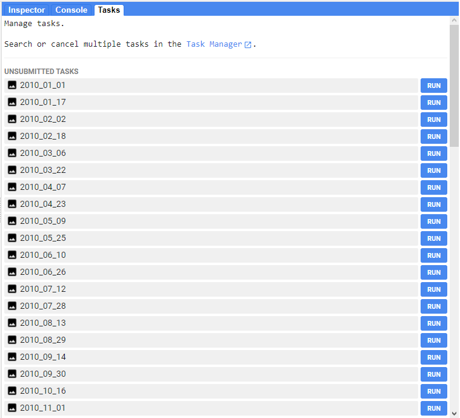

=======================================================================
1. Export MODIS satellite images from Google Earth Engine
=======================================================================
*Written by Men Vuthy, 2021*

---------------

Objective
---------------

* Export a collection of MODIS - NDVI images from early 2010 to late 2012.

Dataset
---------------

The `MOD13Q1 V6 <https://developers.google.com/earth-engine/datasets/catalog/MODIS_006_MOD13Q1#description>`__ product provides a Vegetation Index (VI) value at a per pixel basis. There are two primary vegetation layers. The first is the Normalized Difference Vegetation Index (NDVI) which is referred to as the continuity index to the existing National Oceanic and Atmospheric Administration-Advanced Very High Resolution Radiometer (NOAA-AVHRR) derived NDVI. The second vegetation layer is the Enhanced Vegetation Index (EVI) that minimizes canopy background variations and maintains sensitivity over dense vegetation conditions. The EVI also uses the blue band to remove residual atmosphere contamination caused by smoke and sub-pixel thin cloud clouds. The MODIS NDVI and EVI products are computed from atmospherically corrected bi-directional surface reflectances that have been masked for water, clouds, heavy aerosols, and cloud shadows.

|

Code
---------------

**1. Visualize study area**

.. code-block:: JavaScript

    // Define study area
    var pursat = ee.FeatureCollection("users/vuthy/pursat");
    Map.centerObject(pursat, 9);
    Map.addLayer(pursat, {color : 'green'}, 'Pursat province')

|

**2. Load and filter MODIS images**

.. code-block:: JavaScript

    // Define study period  (see info about collection) 
    var startdate = ee.Date('2010-01-01');
    var enddate = ee.Date('2012-12-31'); 

    // Load a MODIS image and select bands 
    var l5 = ee.ImageCollection('MODIS/006/MOD13Q1')
                .filterDate(startdate, enddate)
                .select(['NDVI']);

**3. Define function to export images from ImageCollection**

.. code-block:: JavaScript

    var ExportCol = function(col, folder, scale,region, type,
                            nimg, maxPixels) {
        type = type || "float";
        nimg = nimg || 500;
        scale = scale || 1000;
        maxPixels = maxPixels || 1e13;

        var colList = col.toList(nimg);
        var n = colList.size().getInfo();

        for (var i = 0; i < n; i++) {
        var img = ee.Image(colList.get(i)).clip(region);
        var id = img.id().getInfo();
        var imgtype = {"float":img.toFloat(), 
                        "byte":img.toByte(), 
                        "int":img.toInt(),
                        "double":img.toDouble()
                        }

        Export.image.toDrive({
            image:imgtype[type],
            description: id,
            folder: folder,
            fileNamePrefix: id,
            region: region,
            scale: scale,
            crs: 'EPSG:4326',
            maxPixels: maxPixels})
        }
    }

**4. Export all images from ImageCollection**

.. code-block:: JavaScript
    
    ExportCol(l5, "modis_ndvi_2010_2012", 250, pursat); 

By clicking all ``RUN`` buttons, each image will be exported to registered google drive. 

