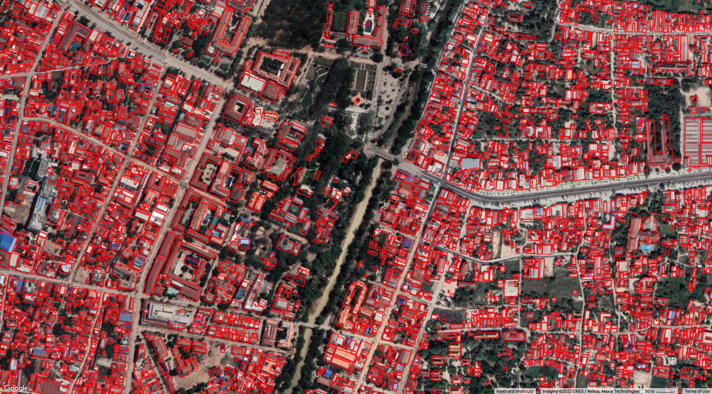
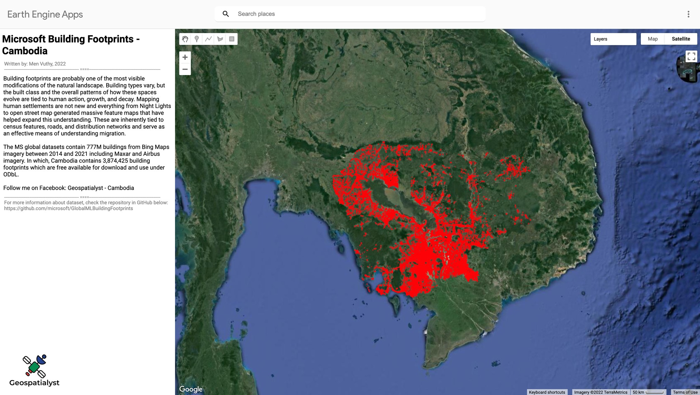

Visualize Microsoft building footprint of Cambodia in Google Earth Engine
==========================================================================================

--------------------

**Overview**

MS global datasets contain 777M buildings from Bing Maps imagery between 2014 and 2021 including Maxar and Airbus imagery. Cambodia contains 3,874,425 building footprints which are freely available for download and use under ODbL.

Read more about dataset at:

- Medium: https://samapriyaroy.medium.com/microsoft-building-footprints-in-gee-revisiting-scale-accessibility-eee5e97c17a3
- GitHub: https://github.com/microsoft/GlobalMLBuildingFootprints

.. raw:: html

    <iframe width=100% height="600px" src="https://vuthy.users.earthengine.app/view/building-footprint---cambodia?fbclid=IwAR1ZiExCvlzb8cfIB0-lOBR6XfEq-_di847qiHd5WGZnSxyFoab2gAGiU0g" title="MS Building Footprint Cambodia" frameborder="1" allowfullscreen></iframe>

`View in fullscreen <https://vuthy.users.earthengine.app/view/building-footprint---cambodia?fbclid=IwAR1ZiExCvlzb8cfIB0-lOBR6XfEq-_di847qiHd5WGZnSxyFoab2gAGiU0g>`__

----------

**Objective**

* Create an GEE App to visualize microsoft buiding footprints in Cambodia.

**Code**

..  code-block:: JavaScript

    // Generate main panel and add it to the map.
    var panel = ui.Panel({style: {width:'25%'}});
    ui.root.insert(0,panel);

    // Define title and description.
    var intro = ui.Label('Microsoft Building Footprints - Cambodia ',
    {fontWeight: 'bold', fontSize: '24px', margin: '10px 5px'}
    );

    var subtitle = ui.Label('Building footprints are probably one of the most \
    visible modifications of the natural landscape. Building types vary, but \
    the built class and the overall patterns of how these spaces evolve are \
    tied to human action, growth, and decay. Mapping human settlements are not \
    new and everything from Night Lights to open street map generated massive \
    feature maps that have helped expand this understanding. These are \
    inherently tied to census features, roads, and distribution networks and \
    serve as an effective means of understanding migration.', {});

    var subtitle1 = ui.Label('The MS global datasets contain 777M buildings \
    from Bing Maps imagery between 2014 and 2021 including Maxar and Airbus \
    imagery. In which, Cambodia contains 3,874,425 building footprints which \
    are free available for download and use under ODbL. ', {});

    var subtitle2 = ui.Label('Follow me on Facebook: Geospatialyst - Cambodia');

    var description2 = ui.Label('For more information about dataset, check the repository \
    in GitHub below: https://github.com/microsoft/GlobalMLBuildingFootprints',
    {margin: '0 0 0 10px',fontSize: '12px',color: 'gray'});

    var space2 = ui.Label('-', {margin: '0 0 0 10px',fontSize: '12px',color: 'white'}); 

    
    var description3 = ui.Label('Written by: Men Vuthy, 2022',
    {margin: '0 0 0 10px',fontSize: '12px',color: 'gray'});
    
    var line1 = ui.Label('-----------------------------------------------------------------\
                    ====--------------------------------------------------------------',
    {margin: '0 0 0 10px',fontSize: '10px',color: 'gray'}); 
    
    var line2 = ui.Label('-----------------------------------------------------------------\
                    ====--------------------------------------------------------------',
    {margin: '0 0 0 10px',fontSize: '10px',color: 'gray'}); 

    // Add title and description to the panel.  
    panel.add(intro).add(description3).add(line1).add(subtitle).add(subtitle1).add(subtitle2).add(line2)
    .add(description2);

    Map.setOptions('SATELLITE');
    // Define map center (In this case in Cambodia)
    Map.setCenter(105.103731, 12.631340, 7);

    var objects = ee.data.listAssets('projects/sat-io/open-datasets/MSBuildings')
    print('Assets in MS Global Buildings Footprint Folder', objects['assets'])

    print(ee.FeatureCollection('projects/sat-io/open-datasets/MSBuildings/Cambodia').size())

    var feature = ee.FeatureCollection('projects/sat-io/open-datasets/MSBuildings/Cambodia')
    Map.addLayer(feature.style({fillColor: '00000000',color: 'red'}),{},'Cambodia')

**Result**

