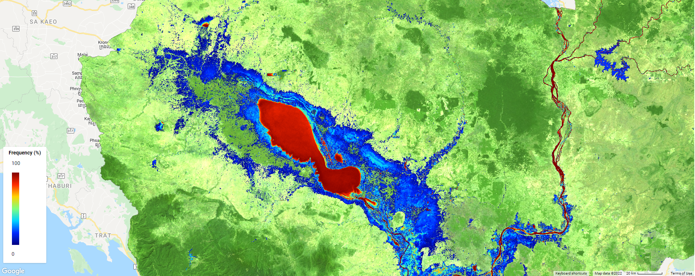
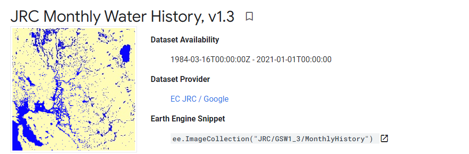

𝗠𝗮𝗽𝗽𝗶𝗻𝗴 𝗳𝗹𝗼𝗼𝗱 𝗳𝗿𝗲𝗾𝘂𝗲𝗻𝗰𝘆 𝗶𝗻 𝗖𝗮𝗺𝗯𝗼𝗱𝗶𝗮 𝗳𝗿𝗼𝗺 𝟭𝟵𝟴𝟴 𝘁𝗼 𝟮𝟬𝟮𝟬 𝘂𝘀𝗶𝗻𝗴 𝗚𝗼𝗼𝗴𝗹𝗲 𝗘𝗮𝗿𝘁𝗵 𝗘𝗻𝗴𝗶𝗻𝗲
==========================================================================================
*Written by Men Vuthy, 2022*

----------

**Overview**

In this project, I try to develop a Google Earth Engine App that help us quickly visualize the flood frequency map of Cambodia from 1988 to 2020 using the dataset from JRC. The Joint Research Centre (JRC) Monthly Water History dataset contains maps of the location and temporal distribution of surface water from 1984 to 2020 at 30-metre resolution and provides statistics on the extent and change of those water surfaces; however, the data covering Cambodia is avalaible only from 1988.

**Earth Engine Apps**

`Open in full screen <https://vuthy.users.earthengine.app/view/cambodia-flood-frequency-map>`__

.. raw:: html

    <iframe width=100% height="600px" src="https://vuthy.users.earthengine.app/view/cambodia-flood-frequency-map" title="Flood Frequency Map - Cambodia" frameborder="1" allowfullscreen></iframe>

----------

**Objective**

* Develop a Google Earth Engine App to visualize the flood frequency map of Cambodia from 1988 to 2020 using the dataset from JRC.

**Dataset**

`JRC Monthly Water History Dataset <https://developers.google.com/earth-engine/datasets/catalog/JRC_GSW1_3_MonthlyHistory#description>`__ contains maps of the location and temporal distribution of surface water from 1984 to 2020 and provides statistics on the extent and change of those water surfaces. For more information see the associated journal article: High-resolution mapping of global surface water and its long-term changes (Nature, 2016).

These data were generated using 4,453,989 scenes from Landsat 5, 7, and 8 acquired between 16 March 1984 and 31 December 2020. Each pixel was individually classified into water / non-water using an expert system and the results were collated into a monthly history for the entire time period and two epochs (1984-1999, 2000-2020) for change detection.

This Monthly History collection holds the entire history of water detection on a month-by-month basis. The collection contains 442 images, one for each month between March 1984 and December 2020.

**Code**

The script to create an app to view flood frequency map is detailed as follows:

.. code-block:: JavaScript

    //----------------------------- Import Dataset and Parameter Setting --------------------------//
    // import dataset
    var jrcDataset = ee.ImageCollection("JRC/GSW1_3/MonthlyHistory");
        
    // Define layer for the selected countries in Southern Africa
    var countriesLayer = ee.FeatureCollection('USDOS/LSIB_SIMPLE/2017');

    // Define the boundary of Cambodia
    var geometry = countriesLayer.filter(ee.Filter.eq('country_co', 'CB'));

    ui.root.clear();
    var map = ui.Map();
    ui.root.add(map);

    // Define map center (In this case in Cambodia)
    map.setCenter(105.103731, 12.631340, 7);

    // Define the variables for the application
    var startDate = '1988-01-01';
    var endDate = '2020-12-31';

    // Define the date selector using textbox for now until Calendar selector is included
    var startDateWidget = ui.Textbox({
    value: startDate,
    style: {width: '100px'},
    });

    var endDateWidget = ui.Textbox({
    value: endDate,
    style: {width: '100px'},
    });

    // Add description title
    var input_date_head = ui.Label('2. Input date of flood event (yyyy-mm-dd)',
    {margin: '0 0 0 10px', fontWeight:'bold', fontSize: '14px'});
    
    var input_startdate = ui.Label('From:', {fontSize: '12px',color: 'gray'})
    var input_enddate = ui.Label('To:', {fontSize: '12px',color: 'gray'})
    
    //----------------------------- Landsat 8 Basemap --------------------------//
    // Fuction to mask cloud on Landsat 8
    function maskL8sr(image) {
    // Bits 3 and 5 are cloud shadow and cloud, respectively.
    var cloudShadowBitMask = (1 << 3);
    var cloudsBitMask = (1 << 5);
    // Get the pixel QA band.
    var qa = image.select('pixel_qa');
    // Both flags should be set to zero, indicating clear conditions.
    var mask = qa.bitwiseAnd(cloudShadowBitMask).eq(0)
                    .and(qa.bitwiseAnd(cloudsBitMask).eq(0));
    return image.updateMask(mask);
    }

    // Add description title
    var landsat_head = ui.Label('1. Add basemap',
    {margin: '0 0 0 10px', fontWeight:'bold', fontSize: '14px'});

    var landsat_text = ui.Label('Click the button below to add Landsat 8 image of 2020 as basemap:', 
    {fontSize: '12px',color: 'gray'})

    // Add basemap button
    var basemapButton = ui.Button({
    label: 'Display Basemap',
    onClick: function() {
        var landsat8 = ee.ImageCollection('LANDSAT/LC08/C01/T1_SR')
                    .filterDate('2020-01-01', '2020-12-31')
                    .map(maskL8sr);
        var visParams = {bands: ['B7', 'B6', 'B4'], min: 0, max: 3000, gamma: 1.4};
        map.centerObject(geometry);
        return map.addLayer(landsat8.median().clip(geometry), visParams, 'Landsat 8 - 2020')
    }
    });
    
    //----------------------------- Flood Frequency Mapping --------------------------//
    // Prepare the core functions
    var getFilteredData = function (geometry, startDate, endDate) {
    return jrcDataset.filterBounds(geometry).filterDate(startDate, endDate);
    };

    var getValidData = function (imgColl) {
    return imgColl.map(function (img) {
        return img.gt(0).set('system:time_start', img.get('system:time_start'));
    });
    };

    var getWaterData = function (imgColl) {
    return imgColl.map(function (img) {
        return img.select('water').eq(2).set('system:time_start', img.get('system:time_start'));
    });
    };

    var floodFrequencyCalculator = function () {
    var filteredData = getFilteredData(geometry, startDate, endDate);
    var validData = getValidData(filteredData);
    var waterData = getWaterData(filteredData);
    var totalValidData = validData.sum().toFloat();
    var totalWaterData = waterData.sum().toFloat();
    var totalWaterPercent = totalWaterData.divide(totalValidData).multiply(100);
    var waterMask = totalWaterPercent.gt(1);
    var waterPercentData = totalWaterPercent.updateMask(waterMask).clip(geometry);
    return waterPercentData;
    };

    // Add visualization parameter
    // Get a palette: a list of hex strings
    var palettes = require('users/gena/packages:palettes');
    var palette = palettes.misc.jet[7];

    var visParam = {"min":0,"max":100,"palette":palette};

    // Add description
    var flood_map_head = ui.Label('3. Mapping Flood frequency',
    {margin: '0 0 0 10px', fontWeight:'bold', fontSize: '14px'});

    var flood_map_text = ui.Label('Click the button below to add display the flood frequency map:', 
    {fontSize: '12px',color: 'gray'})
    
    // Add the submit button
    var submitButton = ui.Button({
    label: 'Display Flood Map',
    onClick: function() {
        startDate = startDateWidget.getValue();
        endDate = endDateWidget.getValue();
        var layer = floodFrequencyCalculator();
        map.centerObject(geometry);
        return map.addLayer(layer, visParam, 'Flood Frequency Map');
    }
    });

    //----------------------------- Display legend on the map --------------------------//
    // set position of panel
    var legend = ui.Panel({
    style: {
    position: 'bottom-left',
    padding: '8px 15px'
    }
    });
    
    // Create legend title
    var legendTitle = ui.Label({
    value: 'Frequency (%)',
    style: {
    fontWeight: 'bold',
    fontSize: '14px',
    margin: '0 0 4px 0',
    padding: '0'
    }
    });
    
    // Add the title to the panel
    legend.add(legendTitle);
    
    // create the legend image
    var lon = ee.Image.pixelLonLat().select('latitude');
    var gradient = lon.multiply((visParam.max-visParam.min)/100.0).add(visParam.min);
    var legendImage = gradient.visualize(visParam);
    
    // create text on top of legend
    var panel = ui.Panel({
    widgets: [
    ui.Label(visParam['max'])
    ],
    });
    
    legend.add(panel);
    
    // create thumbnail from the image
    var thumbnail = ui.Thumbnail({
    image: legendImage,
    params: {bbox:'0,0,10,100', dimensions:'20x200'},
    style: {padding: '1px', position: 'bottom-right'}
    });
    
    // add the thumbnail to the legend
    legend.add(thumbnail);
    
    // create text on top of legend
    var panel = ui.Panel({
    widgets: [
    ui.Label(visParam['min'])
    ],
    });
    
    legend.add(panel);
    map.add(legend);

    //----------------------------- Create User Interface (UI) --------------------------//
    // Set the title UI
    var titlePanel = ui.Panel({style: {position: 'top-center', width: '550px',stretch: 'horizontal', height: '45px',margin:'-10px'}});
    var title = ui.Label({
    value: 'Cambodia Flood Frequency Mapping (1988 - 2020)',
    style: {height: '40px', width: '520px',fontSize: '18px', fontWeight:'bold',textAlign: 'center', padding:'10px', margin: '-5px'},
    });
    titlePanel.add(title);
    map.add(titlePanel);

    // Add the panel to the ui.root.
    var widgetPanel = ui.Panel({style: {width: '400px'}});

    var Title = ui.Label({value:'Flood Frequency Mapping',style:{fontSize: '20px', fontWeight: 'bold'}});

    var space = ui.Label('-', {margin: '0 0 0 10px',fontSize: '12px',color: 'white'}); 

    var description1 = ui.Label('The purpose of the script is to map flood frequency in Cambodia from 1988 to 2020 using \
                    the Joint Research Centre (JRC) Monthly Water History dataset. This dataset contains maps of the location\
                    and temporal distribution of surface water from 1984 to 2020 and provides statistics on the extent and\
                    change of those water surfaces; however, the data is avalaible in Cambodia only from 1988.',
    {margin: '0 0 0 10px',fontSize: '12px',color: 'gray'});
    
    var space1 = ui.Label('-', {margin: '0 0 0 10px',fontSize: '12px',color: 'white'}); 

    var description2 = ui.Label('For more information see the associated journal article: Pekel et al. \
                    High-resolution mapping of global surface water and its long-term changes. \
                    Nature 540, 418–422 (2016). https://doi.org/10.1038/nature20584',
    {margin: '0 0 0 10px',fontSize: '12px',color: 'gray'});

    var space2 = ui.Label('-', {margin: '0 0 0 10px',fontSize: '12px',color: 'white'}); 

    
    var description3 = ui.Label('The script is written by: Men Vuthy, 2022',
    {margin: '0 0 0 10px',fontSize: '12px',color: 'gray'});
    
    var description4 = ui.Label('Website: https://geospatialyst.readthedocs.io/en/latest/#',
    {margin: '0 0 0 10px',fontSize: '12px',color: 'gray'});
    
    var line1 = ui.Label('-----------------------------------------------------------------\
                    ====--------------------------------------------------------------',
    {margin: '0 0 0 10px',fontSize: '10px',color: 'gray'}); 
    
    var line2 = ui.Label('-----------------------------------------------------------------\
                    ====--------------------------------------------------------------',
    {margin: '0 0 0 10px',fontSize: '10px',color: 'gray'}); 

    widgetPanel.add(Title).add(description1).add(space1).add(description2).add(line1);
    widgetPanel.add(space);
    widgetPanel.add(landsat_head).add(landsat_text).add(basemapButton);
    widgetPanel.add(input_date_head);
    widgetPanel.add(ui.Panel([input_startdate, startDateWidget, input_enddate, endDateWidget], ui.Panel.Layout.flow('horizontal')));
    widgetPanel.add(flood_map_head).add(flood_map_text).add(submitButton).add(line2);
    widgetPanel.add(space2).add(description3).add(description4);

    ui.root.add(widgetPanel);

**Result**

By running the script above in `code editor <https://code.earthengine.google.com>`__ of GEE, the interface will appear as shown in below image. Then, viewers can input the flood event period to visualize the flood frequency map. 

.. figure:: cambodia-flood-frequency/images/flood-interface.png
    :width: 100%
    :align: center
    :alt: flood-interface

