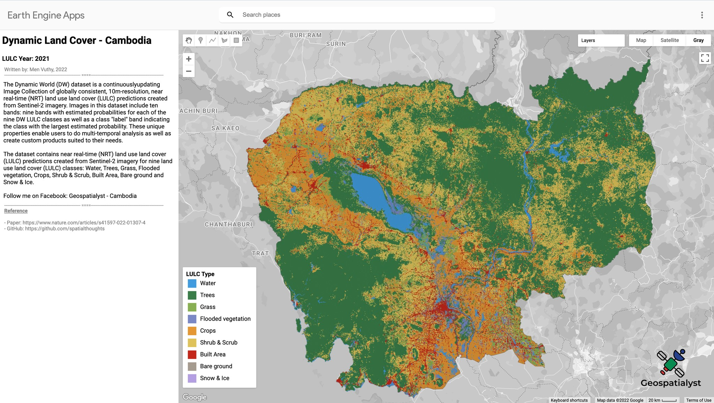
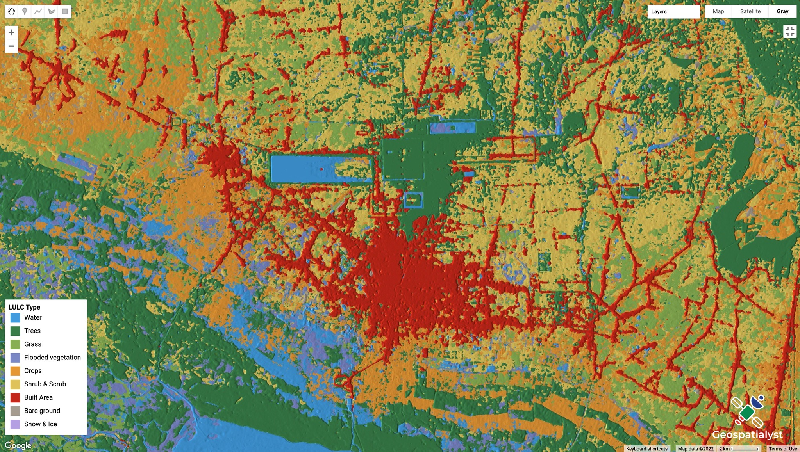
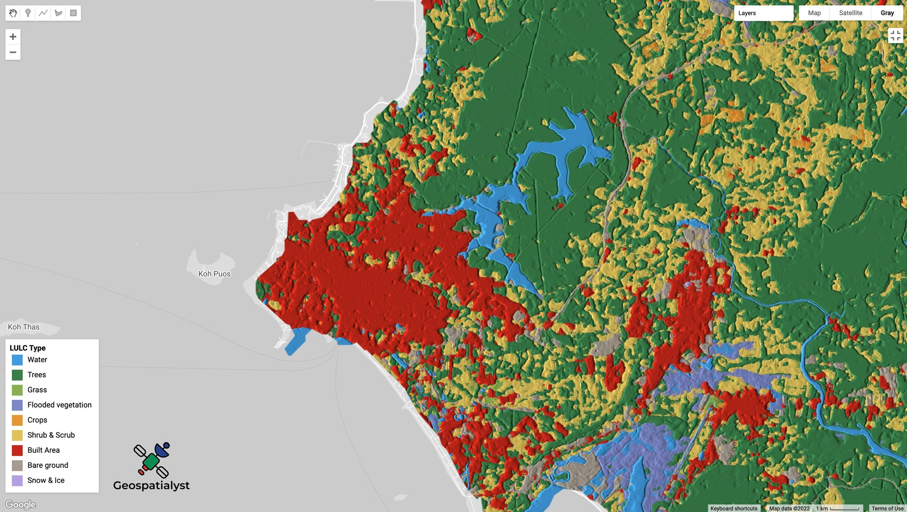

𝗗𝘆𝗻𝗮𝗺𝗶𝗰 & 𝗡𝗲𝗮𝗿 𝗿𝗲𝗮𝗹-𝘁𝗶𝗺𝗲 𝗟𝗮𝗻𝗱 𝗨𝘀𝗲 𝗟𝗮𝗻𝗱 𝗖𝗼𝘃𝗲𝗿 𝗠𝗮𝗽𝗽𝗶𝗻𝗴 - 𝗖𝗮𝗺𝗯𝗼𝗱𝗶𝗮
==========================================================================================

--------------------

.. figure:: dynamic-landcover/images/head-image.png
    :width: 100%
    :align: center
    :alt: cover

**Overview**

The Dynamic World (DW) dataset is a continuously updating Image Collection of globally consistent, 10m-resolution, near real-time (NRT) land use land cover (LULC) predictions created from Sentinel-2 imagery. 

The dataset contains near real-time (NRT) land use land cover (LULC) predictions created from Sentinel-2 imagery for nine land use land cover (LULC) classes: Water, Trees, Grass, Flooded vegetation, Crops, Shrub & Scrub, Built Area, Bare ground and Snow & Ice.

Read more at:

- Paper: https://www.nature.com/articles/s41597-022-01307-4
- GitHub: https://github.com/spatialthoughts

.. raw:: html

    <iframe width=100% height="600px" src="https://vuthy.users.earthengine.app/view/dynamic-lulc-cambodia?fbclid=IwAR1wqfGIcfXPgxJSsmQsLvv2_Tdf8QoxbDX3CaPrtTtDgvmbfzYLD0mnfpI" title="Dynamic Land Cover - Cambodia" frameborder="1" allowfullscreen></iframe>

`View in fullscreen <https://vuthy.users.earthengine.app/view/building-footprint---cambodia?fbclid=IwAR1ZiExCvlzb8cfIB0-lOBR6XfEq-_di847qiHd5WGZnSxyFoab2gAGiU0g>`__

----------

**Objective**

* Create an GEE App to visualize dynamic and near real-time land use and land cover in Cambodia.

**Code**

..  code-block:: JavaScript

    // Generate main panel and add it to the map.
    var panel = ui.Panel({style: {width:'25%'}});
    ui.root.insert(0,panel);

    // Define title and description.
    var intro = ui.Label('Dynamic Land Cover - Cambodia',
    {fontWeight: 'bold', fontSize: '24px', margin: '10px 5px'}
    );
    var year = ui.Label('LULC Year: 2021',
    {fontWeight: 'bold', fontSize: '15px', margin: '10px 5px'}
    );

    var subtitle = ui.Label('The Dynamic World (DW) dataset is a continuously\
    updating Image Collection of globally consistent, 10m-resolution, \
    near real-time (NRT) land use land cover (LULC) predictions created \
    from Sentinel-2 imagery. Images in this dataset include ten bands: \
    nine bands with estimated probabilities for each of the nine DW LULC \
    classes as well as a class "label" band indicating the class with the \
    largest estimated probability. These unique properties enable users to \
    do multi-temporal analysis as well as create custom products suited to \
    their needs.', {});

    var subtitle1 = ui.Label('The dataset contains near real-time (NRT) \
    land use land cover (LULC) predictions created from Sentinel-2 imagery \
    for nine land use land cover (LULC) classes: Water, Trees, Grass, Flooded \
    vegetation, Crops, Shrub & Scrub, Built Area, Bare ground and Snow & Ice.', {});

    var subtitle2 = ui.Label('Follow me on Facebook: Geospatialyst - Cambodia');

    var reference = ui.Label('Reference', {margin: '0 0 0 10px',fontSize: '12px',fontWeight:'bold',color: 'grey',textDecoration: 'underline' });
    var paper = ui.Label('- Paper: https://www.nature.com/articles/s41597-022-01307-4',
    {margin: '0 0 0 10px',fontSize: '12px',color: 'gray'});
    var github = ui.Label('- GitHub: https://github.com/spatialthoughts',
    {margin: '0 0 0 10px',fontSize: '12px',color: 'gray'});

    var space2 = ui.Label('-', {margin: '0 0 0 10px',fontSize: '12px',color: 'white'}); 

    
    var description3 = ui.Label('Written by: Men Vuthy, 2022',
    {margin: '0 0 0 10px',fontSize: '12px',color: 'gray'});
    
    var line1 = ui.Label('-----------------------------------------------------------------\
                    ====--------------------------------------------------------------',
    {margin: '0 0 0 10px',fontSize: '10px',color: 'gray'}); 
    
    var line2 = ui.Label('-----------------------------------------------------------------\
                    ====--------------------------------------------------------------',
    {margin: '0 0 0 10px',fontSize: '10px',color: 'gray'}); 

    // Add title and description to the panel.  
    panel.add(intro).add(year).add(description3).add(line1).add(subtitle).add(subtitle1).add(subtitle2).add(line2)
    .add(reference).add(space2).add(paper).add(github);

    var GRAYMAP = [
    {   // Dial down the map saturation.
    stylers: [ { saturation: -100 } ]
    },{ // Dial down the label darkness.
    elementType: 'labels',
    stylers: [ { lightness: 20 } ]
    },{ // Simplify the road geometries.
    featureType: 'road',
    elementType: 'geometry',
    stylers: [ { visibility: 'simplified' } ]
    },{ // Turn off road labels.
    featureType: 'road',
    elementType: 'labels',
    stylers: [ { visibility: 'off' } ]
    },{ // Turn off all icons.
    elementType: 'labels.icon',
    stylers: [ { visibility: 'off' } ]
    },{ // Turn off all POIs.
    featureType: 'poi',
    elementType: 'all',
    stylers: [ { visibility: 'off' }]
    }
    ];
    
    Map.setOptions('Gray', {'Gray': GRAYMAP});

    // Define map center (In this case in Cambodia)
    // Load country features from Large Scale International Boundary (LSIB) dataset.
    var countries = ee.FeatureCollection('USDOS/LSIB_SIMPLE/2017');
    var geometry = countries.filter(ee.Filter.eq('country_co', 'CB'));
    Map.centerObject(geometry, 8)

    // Filter the Dynamic World NRT collection
    // for the year 2021 over the selected region.
    var startDate = '2021-01-01';
    var endDate = '2022-01-01';

    var dw = ee.ImageCollection('GOOGLE/DYNAMICWORLD/V1')
    .filter(ee.Filter.date(startDate, endDate))
    .filter(ee.Filter.bounds(geometry))

    // Create a Mode Composite
    var classification = dw.select('label')
    var dwComposite = classification.reduce(ee.Reducer.mode());

    var dwVisParams = {
    min: 0,
    max: 8,
    palette: ['#419BDF', '#397D49', '#88B053', '#7A87C6',
        '#E49635', '#DFC35A', '#C4281B', '#A59B8F', '#B39FE1']
    };

    // Clip the composite and add it to the Map
    // Map.addLayer(dwComposite.clip(geometry), dwVisParams, 'Classified Composite') 

    // Create a Top-1 Probability Hillshade Visualization
    var probabilityBands = [
        'water', 'trees', 'grass', 'flooded_vegetation', 'crops',
        'shrub_and_scrub', 'built', 'bare', 'snow_and_ice'
        ];

    // Select probability bands 
    var probabilityCol = dw.select(probabilityBands)

    // Create a multi-band image with the average pixel-wise probability 
    // for each band across the time-period
    var meanProbability = probabilityCol.reduce(ee.Reducer.mean())

    // Composites have a default projection that is not suitable
    // for hillshade computation.
    // Set a EPSG:3857 projection with 10m scale
    var projection = ee.Projection('EPSG:3857').atScale(10)
    var meanProbability = meanProbability.setDefaultProjection(projection)

    // Create the Top1 Probability Hillshade
    var top1Probability = meanProbability.reduce(ee.Reducer.max())
    var top1Confidence = top1Probability.multiply(100).int()
    var hillshade = ee.Terrain.hillshade(top1Confidence).divide(255)
    var rgbImage = dwComposite.visualize(dwVisParams).divide(255);
    var probabilityHillshade = rgbImage.multiply(hillshade)

    var hillshadeVisParams = {min:0, max:0.8}
    Map.addLayer(probabilityHillshade.clip(geometry),
    hillshadeVisParams, 'Probability Hillshade')

    //----------------------------- Display legend on the map --------------------------//
    var panel = ui.Panel({
    style: {
        position: 'bottom-left',
        padding: '5px;'
    }
    })

    var title = ui.Label({
    value: 'LULC Type',
    style: {
        fontSize: '14px',
        fontWeight: 'bold',
        margin: '0px;'
    }
    })

    panel.add(title)

    var color = ['#419BDF', '#397D49', '#88B053', '#7A87C6',
        '#E49635', '#DFC35A', '#C4281B', '#A59B8F', '#B39FE1']
    var lc_class = ['Water', 'Trees', 'Grass', 'Flooded vegetation', 'Crops',
        'Shrub & Scrub', 'Built Area', 'Bare ground', 'Snow & Ice'
        ]

    var list_legend = function(color, description) {
    
    var c = ui.Label({
        style: {
        backgroundColor: color,
        padding: '10px',
        margin: '4px'
        }
    })
    
    var ds = ui.Label({
        value: description,
        style: {
        margin: '5px'
        }
    })
    
    return ui.Panel({
        widgets: [c, ds],
        layout: ui.Panel.Layout.Flow('horizontal')
    })
    }

    for(var a = 0; a < 9; a++){
    panel.add(list_legend(color[a], lc_class[a]))
    }

    Map.add(panel)

**Result**

