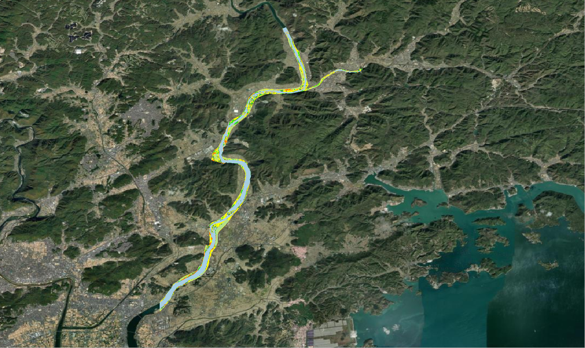
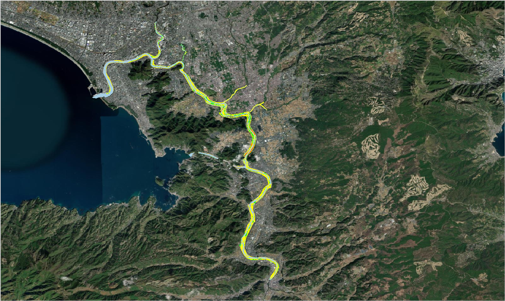
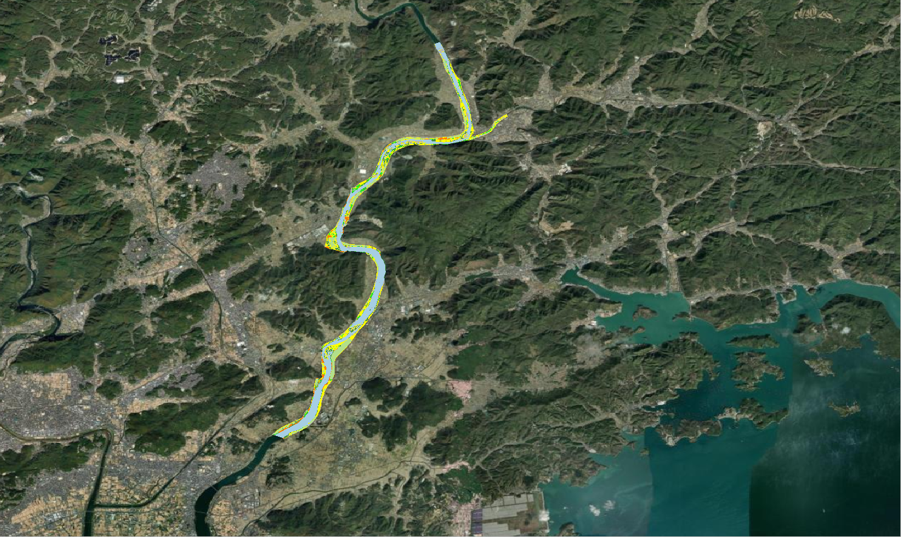

𝗞𝗮𝗻𝗼 & 𝗬𝗼𝘀𝗵𝗶𝗶 𝗿𝗶𝘃𝗲𝗿: 𝗟𝗮𝗻𝗱 𝗰𝗼𝘃𝗲𝗿 𝗰𝗹𝗮𝘀𝘀𝗶𝗳𝗶𝗰𝗮𝘁𝗶𝗼𝗻 𝘂𝘀𝗶𝗻𝗴 𝗺𝗮𝗰𝗵𝗶𝗻𝗲 𝗹𝗲𝗮𝗿𝗻𝗶𝗻𝗴
==========================================================================================

--------------------

**Overview**

In this project, I try to develop supervised machine learning model in Python to classify the land cover type within the river channel. The model is developed by using the training data from 4 seasons of PLANET satellite images with 3-m spatial resolution at Kano and Yoshii river in Japan. 

The land cover is classified into 7 clases:

1. Herbecous
2. Shrub
3. High tree
4. Bamboo
5. Other vegetation
6. Built-up
7. Water surface

The input data for model development is the combination of Kano river and Yoshii river, and totally consists of 1,845,237 data or pixels. Then this data is split into 75% for training and 25% for testing as follows:

- Training data: 1,383,093 pixels
- Testing data: 462,144 pixels

.. image:: kano-and-yoshii-river/images/training_kano.png
    :width: 100%
    :align: center

Figure 1: Training data of Kano river.

Figure 2: Training data of Yoshii river.

.. toctree::
   :maxdepth: 2
   :caption: Codes for model development:

   kano-and-yoshii-river/1-Input Data for Supervised-ML-Kano River.ipynb
   kano-and-yoshii-river/2-Input Data for Supervised-ML-Yoshii River.ipynb
   kano-and-yoshii-river/3-RFC model- Kano&Yoshii River.ipynb
   kano-and-yoshii-river/4-Prediction on Kano, Yoshii & Muromi River.ipynb

**Visualize result**

Figure 3: a. Predicted land cover of Kano river b. Predicted land cover of Yoshii river.

.. image:: kano-and-yoshii-river/images/training_kano_zoom_legend.png
    :width: 47%
    :align: left
.. image:: kano-and-yoshii-river/images/training_yoshii_zoom_legend.png
    :width: 47%

Figure 4: a. Training land cover of Kano river b. Training land cover of of Yoshii river.

.. image:: kano-and-yoshii-river/images/predicted_kano_zoom_legend.png
    :width: 47%
    :align: left
.. image:: kano-and-yoshii-river/images/predicted_yoshii_zoom_legend.png
    :width: 47%

Figure 5: a. Predicted land cover of Kano river b. Predicted land cover of of Yoshii river.