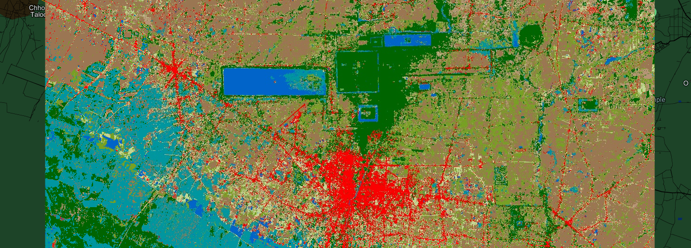

Land cover classification using supervised learning method in Google Earth Engine
==========================================================================================

--------------------

**Overview**

In this project, I try to classify the land use land cover using Random Forest Classifier in Google Earth Engine by:

   - using the images from Sentinel-2 satellite in January 2022
   - using Random Forest Classifier with parameter of 300 trees
   - using the training data from 1000 random points with the label from ESA WorldCover dataset.

**Objective**

* Classify land use and land cover in Google Earth Engine and then visualize it in GEE App.

**Code**

The script to classify the land cover type is detailed as follows:

.. code-block:: JavaScript

    var roi = ee.Geometry.Polygon([[[103.63665096774587, 13.584793535905758],
            [103.63665096774587, 13.264209644744009],
            [104.07061092868337, 13.264209644744009],
            [104.07061092868337, 13.584793535905758]]], null, false);

    var baseChange = [{featureType: 'all', stylers: [{invert_lightness: true}]}];

    Map.setOptions('baseChange', {'baseChange': baseChange});
    Map.centerObject(roi, 10)

    /**
    * Function to mask clouds using the Sentinel-2 QA band
    * @param {ee.Image} image Sentinel-2 image
    * @return {ee.Image} cloud masked Sentinel-2 image
    */
    function maskS2clouds(image) {
    var qa = image.select('QA60');

    // Bits 10 and 11 are clouds and cirrus, respectively.
    var cloudBitMask = 1 << 10;
    var cirrusBitMask = 1 << 11;

    // Both flags should be set to zero, indicating clear conditions.
    var mask = qa.bitwiseAnd(cloudBitMask).eq(0)
        .and(qa.bitwiseAnd(cirrusBitMask).eq(0));

    return image.updateMask(mask).divide(10000);
    }

    var dataset = ee.ImageCollection('COPERNICUS/S2_SR')
                    .filterDate('2022-01-01', '2022-01-30')
                    // Pre-filter to get less cloudy granules.
                    .filter(ee.Filter.lt('CLOUDY_PIXEL_PERCENTAGE',5))
                    .map(maskS2clouds);
                    
    var visualization = {
    min: 0.0,
    max: 0.3,
    bands: ['B4', 'B3', 'B2'],
    };

    var img = ee.Image(dataset.mean()).select('B.*');

    // ESA WorldCover land cover map, used as label source in classifier training.
    var lc = ee.Image('ESA/WorldCover/v100/2020');

    // Remap the land cover class values to a 0-based sequential series.
    var classValues = [10, 20, 30, 40, 50, 60, 70, 80, 90, 95, 100];
    var remapValues = ee.List.sequence(0, 10);
    var label = 'lc';
    lc = lc.remap(classValues, remapValues).rename(label).toByte();

    // Add land cover as a band of the reflectance image and sample 100 pixels at
    // 10 m scale from each land cover class within a region of interest.

    var sample = img.addBands(lc).stratifiedSample({
    numPoints: 1000,
    classBand: label,
    region: roi,
    scale: 10,
    geometries: true
    });

    // Add a random value field to the sample and use it to approximately split 80%
    // of the features into a training set and 20% into a validation set.
    sample = sample.randomColumn();
    var trainingSample = sample.filter('random <= 0.8');
    var validationSample = sample.filter('random > 0.8');

    // Train a 10-tree random forest classifier from the training sample.
    var trainedClassifier = ee.Classifier.smileRandomForest(300).train({
    features: trainingSample,
    classProperty: label,
    inputProperties: img.bandNames()
    });

    // Get information about the trained classifier.
    print('Results of trained classifier', trainedClassifier.explain());

    // Get a confusion matrix and overall accuracy for the training sample.
    var trainAccuracy = trainedClassifier.confusionMatrix();
    print('Training error matrix', trainAccuracy);
    print('Training overall accuracy', trainAccuracy.accuracy());

    // Get a confusion matrix and overall accuracy for the validation sample.
    validationSample = validationSample.classify(trainedClassifier);
    var validationAccuracy = validationSample.errorMatrix(label, 'classification');
    print('Validation error matrix', validationAccuracy);
    print('Validation accuracy', validationAccuracy.accuracy());

    // Classify the reflectance image from the trained classifier.
    var imgClassified = img.classify(trainedClassifier);

    // Add the layers to the map.
    var classVis = {
    min: 0,
    max: 10,
    palette: ['006400' ,'b59475', '77a123', '9b7653', 'fa0000', 'c3d593',
                'f0f0f0', '0064c8', '0096a0', '00cf75', 'fae6a0']
    };

    Map.addLayer(img.clip(roi), {bands: ['B11', 'B8', 'B3'], min: 0, max: 0.5}, 'img');
    Map.addLayer(lc.clip(roi), classVis, 'lc', false);
    Map.addLayer(imgClassified.clip(roi), classVis, 'Classified');
    Map.addLayer(roi, {color: 'white'}, 'ROI', false, 0.5);
    Map.addLayer(trainingSample, {color: 'yellow'}, 'Training sample', false);
    Map.addLayer(validationSample, {color: 'white'}, 'Validation sample', false);

    //----------------------------- Display legend on the map --------------------------//
    var panel = ui.Panel({
    style: {
        position: 'bottom-left',
        padding: '5px;'
    }
    })

    var title = ui.Label({
    value: 'Classification',
    style: {
        fontSize: '14px',
        fontWeight: 'bold',
        margin: '0px;'
    }
    })

    panel.add(title)

    var color = ['006400' ,'b59475', '77a123', '9b7653', 'fa0000', 'c3d593',
                'f0f0f0', '0064c8', '0096a0', '00cf75', 'fae6a0']
    var lc_class = ['Trees', 'Shrubland', 'Grassland', 'Cropland', 'Built-up', 
                'Barren / sparse vegetation', 'Snow and ice', 'Open water', 'Herbaceous wetland',
                'Mangroves', 'Moss and lichen']

    var list_legend = function(color, description) {
    
    var c = ui.Label({
        style: {
        backgroundColor: color,
        padding: '10px',
        margin: '4px'
        }
    })
    
    var ds = ui.Label({
        value: description,
        style: {
        margin: '5px'
        }
    })
    
    return ui.Panel({
        widgets: [c, ds],
        layout: ui.Panel.Layout.Flow('horizontal')
    })
    }

    for(var a = 0; a < 11; a++){
    panel.add(list_legend(color[a], lc_class[a]))
    }

    Map.add(panel)

**Result in GEE App**

`Open in full screen <https://vuthy.users.earthengine.app/view/landuse-classification>`__

.. raw:: html

    <iframe width=100% height="600px" src="https://vuthy.users.earthengine.app/view/landuse-classification" title="Land Use and Land Cover Classification" frameborder="1" allowfullscreen></iframe>

----------