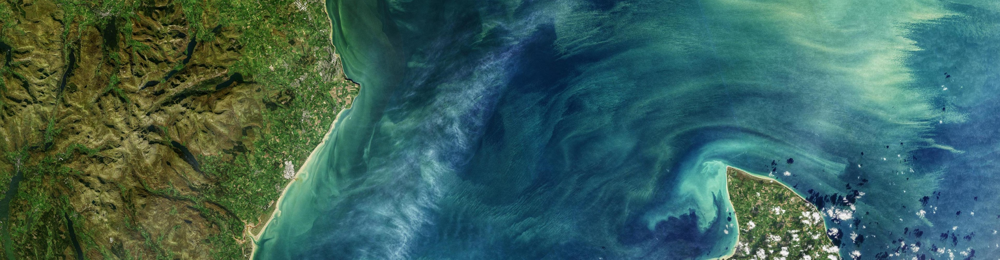

.. Men Vuthy documentation master file, created by
   sphinx-quickstart on Thu Jan 20 23:52:19 2022.
   You can adapt this file completely to your liking, but it should at least
   contain the root `toctree` directive.

**Vuthy's portfolio and documentations**  
------------------------------------------------

My name is **Men Vuthy**. I am a Civil Engineer, specialized in river and geospatial engineering,  with industry experiences in piped-water supply design, hydrological modeling, GIS, mapping, geo-data/satellite image analysis, programming, classification and big data. I am currently an Engineer in River Department at Nippon Koei Co., Ltd based in head quarter in Tokyo, Japan, where I work on different kinds of data sorting tasks, satellite-image analysis and Deep Learning models to do semantic segmentation on satellite images. Besides that, I sometimes offer an online course on `Geospatial Data Analysis with Python <https://geospatialyst.github.io/homepage/course/>`__ to Cambodian graduated students and professionals.

I graduted a master of Civil Engineering degree from The University of Tokyo in Japan in 2020. I recieved solid training in flood simulation and damage assessment, programming languages, machine learning and deep learning. I am proficient in ArcGIS/QGIS, geospatial data analysis, Python and Geo-Python, data retrieval and processing in Google Earth Engine, data classification and extraction, and data visualization. I am particularly interested in working with satelitte image data and dealing with large dataset. On the other hand, I like to spend time learning something new and explore more knowledge from various sources, and then write it down to my personal projects and documentations. More details about some of my projects and documentations can be found in DOCUMENTATIONS pages.

.. toctree::
   :maxdepth: 2
   :hidden:
   :caption: About me

   Content/About-me/about-me
   Content/About-me/resume
   Content/About-me/contact

.. toctree::
   :maxdepth: 2
   :hidden:
   :caption: Lesson

.. toctree::
   :maxdepth: 2
   :hidden:
   :caption: Documentation

   Content/Documentation/lidar
   Content/Documentation/geo-python
   Content/Documentation/google-earth-engine
   Content/Documentation/machine-learning
   Content/Documentation/deep-learning
   
